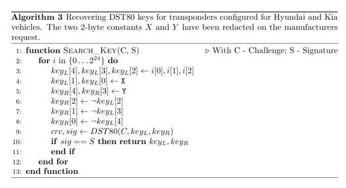

# DST80 Cracker

alg3 from iacr research
https://tches.iacr.org/index.php/TCHES/article/view/8546
optimized in opencl

takes challenge/signature and max number of keys to check as arguments
need to know manufacturer constant to finish can be done by crossing the result on two challenge response that will give those constants it should takes ~1-2 days with RTX4090 then when constant known 1min
As you can see in the logs (test.log) since i bruteforce 2^40 keys with dst80_reverse_purebrute.py to produce 2^24 signatures they are many false positive to get rid of that you need the manufacturer constants to reducd bruteforce of two bytes (2^16) and test 2^24 keys for the 2^24 signatures.
By crossing the results like indicated : testing all challenges/response one time will give some keys then crossing with a new challenge/response then you will have very few false positive ~ 0 if there is no, you will know your manufacturer constants. Then change the algorithm dst80_reverse_aaaa_cte.py with the manufacturer constants to hack the keyfobs belong to that manufacturer within a very short time :)




``
pip3 install numpy opencl  
``

time python3 dst80_reverse_aaaa_cte.py 0xC212345678 0x64cfd0 281474976710656  
time python3 dst80_reverse_purebrute.py 0xC212345678 0x64cfd0 281474976710656  


```
(myenv) nirvana@legion:~/dst80-cracker$ time python3 dst80_reverse_purebrute.py 0xC212345678 0x64cfd0 281474976710656  
PID 0 first sig=0x023710, keyl=0x0000000000, keyr=0xffffffffff   
Found verified match @pid=1: keyl=0xccb6190000, keyr=0xffffe64933, sig=0x64cfd0, target=0x64cfd0  
Found verified match @pid=1: keyl=0xa9ab930000, keyr=0xffff6c5456, sig=0x64cfd0, target=0x64cfd0
```


